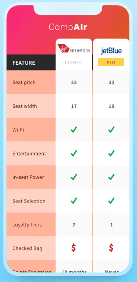

# XampleUI

UI challenge in Xamarin.Forms.

The solution was built on [XF.Shell](https://docs.microsoft.com/en-us/xamarin/xamarin-forms/app-fundamentals/shell/).

Tools: 

[XamlStyler](https://github.com/Xavalon/XamlStyler/) - Auto formatting the XAML file.

[Snipast](https://www.snipaste.com/) - Pin a screenshot to compare.

## 01 Cakes Mobile App

Original design from [Ghulam Rasool](https://dribbble.com/shots/14018398-Cakes-Mobile-App-UX-UI-Design/attachments/5634963?mode=media):

### Page preview

### Coding recording

https://youtu.be/Lq7-2PzsSpY

### Notes

- As I cut the icons and images on my own, so the value of margin or padding in the same row or column might not be consistent.

- The list page items have different size, no idea about how to implement it into an infinite list (tried to make an uneven list before though).

- According to the license, the font files are not uploaded on Git (related code cleaned from latest repo).

When reviewing the development, reliased that cropping and editing images really took a lot of time. And finally got the hang of comparing UI efficiently in the last half an hour, which is to pin a screenshot and change opacity to compare. And first time tried to edit a video, and found that was the moment I realized I need a better CPU.

## 02 Groceries Shopping App

Original design from [Cuberto](https://dribbble.com/shots/6120171-Groceries-Shopping-App-Interaction):

### Page Preview

### Tasks

- [ ] item transition to detail
- [x] item transition to cart
- [x] real cart
- [x] scroll animation
- [x] Uneven list view

### Nuget Used

[Xamarin.Plugin.SharedTransitions](https://www.nuget.org/packages/Xamarin.Plugin.SharedTransitions/)

## 03 Comparison Chart

Original design from [Shaun Paduano](https://dribbble.com/shots/5099331-Mobile-Comparison-Chart/attachments/5099331-Mobile-Comparison-Chart?mode=media):

### Page preview

### Coding recording

https://youtu.be/2hE8r1cWRB4

### Notes

Issues fixed (not in the video): 

1. PIN button position and switch issue,
2. use a new property for the pinned list
3. Update the mock data and page binding

Issues left:

- [ ] Scroll page height
- [ ] disposed object issue

## More coming

Loading...