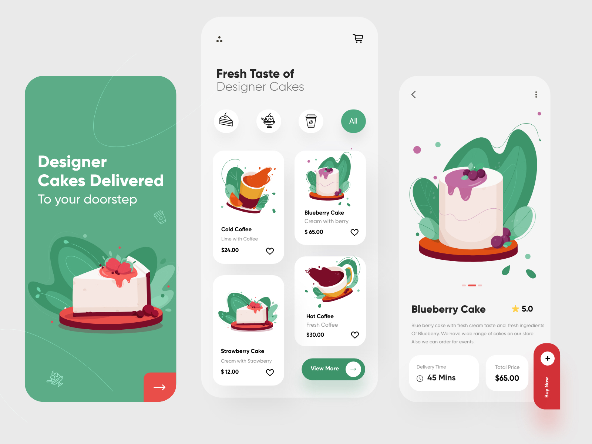
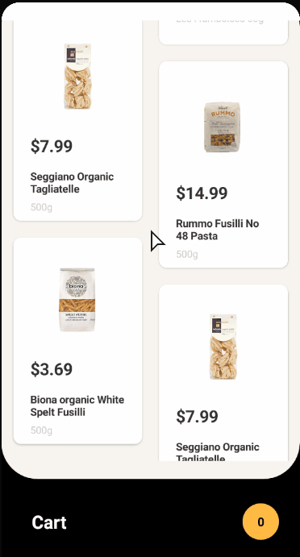
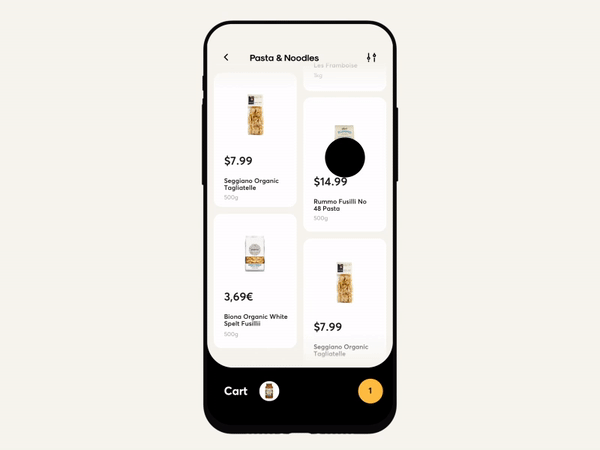
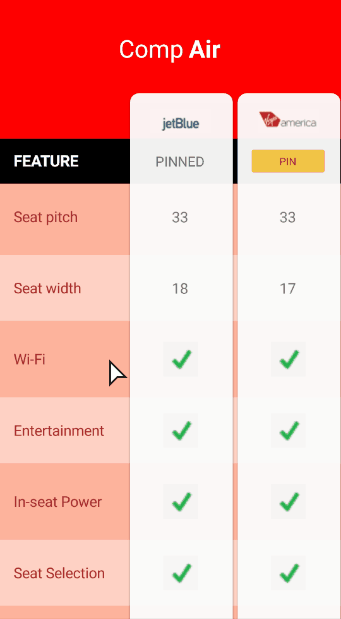
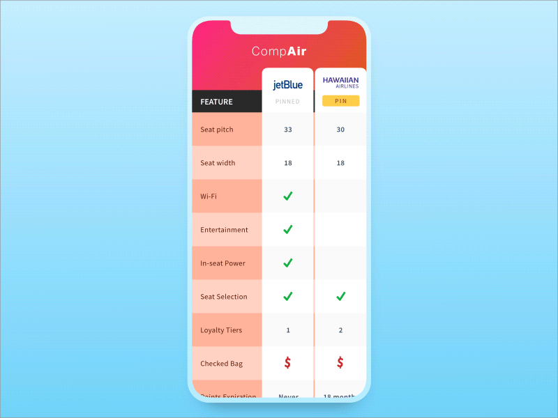

# XampleUI

// A Xamarin.Forms solution to replicate interesting UI design.

var XampleUI = "Xamarin sample UI";

var Template = "[XF.Shell](https://docs.microsoft.com/en-us/xamarin/xamarin-forms/app-fundamentals/shell/)";

var HandyTools = {"[XamlStyler](https://github.com/Xavalon/XamlStyler/)", "[Snipast](https://www.snipaste.com/)"};

var TableOfContents = {

&nbsp;&nbsp;&nbsp;&nbsp;**[01 Cakes Mobile App](#01-cakes-mobile-app)**

&nbsp;&nbsp;&nbsp;&nbsp;**[02 Groceries Shopping App](#02-groceries-shopping-app)**

&nbsp;&nbsp;&nbsp;&nbsp;**[03 Comparison Chart](#03-comparison-chart)**

};

## 01 Cakes Mobile App

| App Preview                                          | Original design ([Ghulam Rasool](https://dribbble.com/shots/14018398-Cakes-Mobile-App-UX-UI-Design/attachments/5634963?mode=media)) |
| ---------------------------------------------------- | ------------------------------------------------------------ |
|  |        |

### :video_camera: Video Recording

https://youtu.be/Lq7-2PzsSpY

### :memo: ​Notes

- Margin or padding in the same row or column might not be consistent (as a rookie image cutter).
- Different item size makes it difficult to turn into an infinite list.
- Pin a screenshot ([Snipast](https://www.snipaste.com/)) made UI QA easier.
- Cropping and editing images are time-consuming. 
- Rendering a video requires a better CPU.
- Font in "this" page is different from the gif above (By the font license, font files are not pushed).

## 02 Groceries Shopping App

| App Preview                                          | Original design ([Cuberto](https://dribbble.com/shots/6120171-Groceries-Shopping-App-Interaction)) |
| ---------------------------------------------------- | ------------------------------------------------------------ |
|  |        |

### :memo: ​Tasks

- [ ] item transition to detail
- [x] item transition to cart
- [x] real cart
- [x] scroll animation
- [x] Uneven list view

### :package: Nuget Used

[Xamarin.Plugin.SharedTransitions](https://www.nuget.org/packages/Xamarin.Plugin.SharedTransitions/)

## 03 Comparison Chart

| App Preview                                                  | Original design ([Shaun Paduano](https://dribbble.com/shots/5099331-Mobile-Comparison-Chart/attachments/5099331-Mobile-Comparison-Chart?mode=media)) |
| ------------------------------------------------------------ | ------------------------------------------------------------ |
|  |  |

### :video_camera: Video Recording

https://youtu.be/2hE8r1cWRB4

### :memo: Notes

Issues out of the video: 

- [x] PIN button position and switch issue,
- [x] use a new property for the pinned list
- [x] Update the mock data and page binding
- [ ] Scroll page height
- [ ] disposed object issue

## More coming

:construction: Loading...